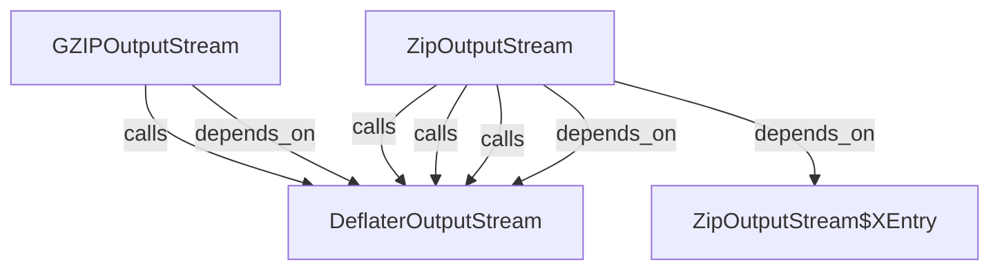

# Reasoning Agent Trace

## Agent Thought
Okay, I will start by analyzing the patch changes using the `get_patch_analysis` tool to understand the modifications in each file. Then, I will use `search_candidates` to find the corresponding files in the target repository. After that, I will use `get_class_context` to verify the content of the identified target files and ensure the changes are applicable. Finally, I will create an implementation plan and submit it using the `submit_plan` tool.

### Tool Calls
- **get_patch_analysis**: `{}`

## Tool Output (get_patch_analysis)
```json
[
  {
    "file_path": "src/java.base/share/classes/java/util/zip/DeflaterOutputStream.java",
    "change_type": "MODIFIED",
    "added_lines": [
      "try {",
      "finish();",
      "} finally {",
      "if (usesDefaultDeflater)",
      "def.end();",
      "}"
    ],
    "removed_lines": [
      "finish();",
      "if (usesDefaultDeflater)",
      "def.end();"
    ]
  },
  {
    "file_path": "src/java.base/share/classes/java/util/zip/GZIPOutputStream.java",
    "change_type": "MODIFIED",
    "added_lines": [
      "try {",
      "def.finish();",
      "while (!def.finished()) {",
      "int len = def.deflate(buf, 0, buf.length);",
      "if (def.finished() && len <= buf.length - TRAILER_SIZE) {",
      "// last deflater buffer. Fit trailer at the end",
      "writeTrailer(buf, len);",
      "len = len + TRAILER_SIZE;",
      "out.write(buf, 0, len);",
      "return;",
      "}",
      "if (len > 0)",
      "out.write(buf, 0, len);",
      "// if we can't fit the trailer at the end of the last",
      "// deflater buffer, we write it separately",
      "byte[] trailer = new byte[TRAILER_SIZE];",
      "writeTrailer(trailer, 0);",
      "out.write(trailer);",
      "} catch (IOException e) {",
      "if (usesDefaultDeflater)",
      "def.end();",
      "throw e;"
    ],
    "removed_lines": [
      "def.finish();",
      "while (!def.finished()) {",
      "int len = def.deflate(buf, 0, buf.length);",
      "if (def.finished() && len <= buf.length - TRAILER_SIZE) {",
      "// last deflater buffer. Fit trailer at the end",
      "writeTrailer(buf, len);",
      "len = len + TRAILER_SIZE;",
      "out.write(buf, 0, len);",
      "return;",
      "if (len > 0)",
      "out.write(buf, 0, len);",
      "// if we can't fit the trailer at the end of the last",
      "// deflater buffer, we write it separately",
      "byte[] trailer = new byte[TRAILER_SIZE];",
      "writeTrailer(trailer, 0);",
      "out.write(trailer);"
    ]
  },
  {
    "file_path": "src/java.base/share/classes/java/util/zip/ZipOutputStream.java",
    "change_type": "MODIFIED",
    "added_lines": [
      "try {",
      "ZipEntry e = current.entry;",
      "switch (e.method) {",
      "case DEFLATED -> {",
      "def.finish();",
      "while (!def.finished()) {",
      "deflate();",
      "}",
      "if ((e.flag & 8) == 0) {",
      "// verify size, compressed size, and crc-32 settings",
      "if (e.size != def.getBytesRead()) {",
      "throw new ZipException(",
      "\"invalid entry size (expected \" + e.size +",
      "\" but got \" + def.getBytesRead() + \" bytes)\");",
      "}",
      "if (e.csize != def.getBytesWritten()) {",
      "throw new ZipException(",
      "\"invalid entry compressed size (expected \" +",
      "e.csize + \" but got \" + def.getBytesWritten() + \" bytes)\");",
      "}",
      "if (e.crc != crc.getValue()) {",
      "throw new ZipException(",
      "\"invalid entry CRC-32 (expected 0x\" +",
      "Long.toHexString(e.crc) + \" but got 0x\" +",
      "Long.toHexString(crc.getValue()) + \")\");",
      "}",
      "} else {",
      "e.size = def.getBytesRead();",
      "e.csize = def.getBytesWritten();",
      "e.crc = crc.getValue();",
      "writeEXT(e);",
      "}",
      "def.reset();",
      "written += e.csize;",
      "case STORED -> {",
      "// we already know that both e.size and e.csize are the same",
      "if (e.size != written - locoff) {",
      "throw new ZipException(",
      "\"invalid entry size (expected \" + e.size +",
      "\" but got \" + (written - locoff) + \" bytes)\");",
      "}",
      "if (e.crc != crc.getValue()) {",
      "throw new ZipException(",
      "\"invalid entry crc-32 (expected 0x\" +",
      "Long.toHexString(e.crc) + \" but got 0x\" +",
      "Long.toHexString(crc.getValue()) + \")\");",
      "}",
      "default -> throw new ZipException(\"invalid compression method\");",
      "crc.reset();",
      "current = null;",
      "} catch (IOException e) {",
      "if (usesDefaultDeflater && !(e instanceof ZipException))",
      "def.end();",
      "throw e;"
    ],
    "removed_lines": [
      "ZipEntry e = current.entry;",
      "switch (e.method) {",
      "case DEFLATED -> {",
      "def.finish();",
      "while (!def.finished()) {",
      "deflate();",
      "}",
      "if ((e.flag & 8) == 0) {",
      "// verify size, compressed size, and crc-32 settings",
      "if (e.size != def.getBytesRead()) {",
      "throw new ZipException(",
      "\"invalid entry size (expected \" + e.size +",
      "\" but got \" + def.getBytesRead() + \" bytes)\");",
      "}",
      "if (e.csize != def.getBytesWritten()) {",
      "throw new ZipException(",
      "\"invalid entry compressed size (expected \" +",
      "e.csize + \" but got \" + def.getBytesWritten() + \" bytes)\");",
      "if (e.crc != crc.getValue()) {",
      "throw new ZipException(",
      "\"invalid entry CRC-32 (expected 0x\" +",
      "Long.toHexString(e.crc) + \" but got 0x\" +",
      "Long.toHexString(crc.getValue()) + \")\");",
      "} else {",
      "e.size = def.getBytesRead();",
      "e.csize = def.getBytesWritten();",
      "e.crc = crc.getValue();",
      "writeEXT(e);",
      "def.reset();",
      "written += e.csize;",
      "}",
      "case STORED -> {",
      "// we already know that both e.size and e.csize are the same",
      "if (e.size != written - locoff) {",
      "throw new ZipException(",
      "\"invalid entry size (expected \" + e.size +",
      "\" but got \" + (written - locoff) + \" bytes)\");",
      "}",
      "if (e.crc != crc.getValue()) {",
      "throw new ZipException(",
      "\"invalid entry crc-32 (expected 0x\" +",
      "Long.toHexString(e.crc) + \" but got 0x\" +",
      "Long.toHexString(crc.getValue()) + \")\");",
      "}",
      "}",
      "default -> throw new ZipException(\"invalid compression method\");",
      "crc.reset();",
      "current = null;"
    ]
  },
  {
    "file_path": "test/jdk/java/util/zip/CloseDeflaterTest.java",
    "change_type": "ADDED",
    "added_lines": [
      "/*",
      "* Copyright (c) 2021, Oracle and/or its affiliates. All rights reserved.",
      "* DO NOT ALTER OR REMOVE COPYRIGHT NOTICES OR THIS FILE HEADER.",
      "*",
      "* This code is free software; you can redistribute it and/or modify it",
      "* under the terms of the GNU General Public License version 2 only, as",
      "* published by the Free Software Foundation.",
      "*",
      "* This code is distributed in the hope that it will be useful, but WITHOUT",
      "* ANY WARRANTY; without even the implied warranty of MERCHANTABILITY or",
      "* FITNESS FOR A PARTICULAR PURPOSE.  See the GNU General Public License",
      "* version 2 for more details (a copy is included in the LICENSE file that",
      "* accompanied this code).",
      "*",
      "* You should have received a copy of the GNU General Public License version",
      "* 2 along with this work; if not, write to the Free Software Foundation,",
      "* Inc., 51 Franklin St, Fifth Floor, Boston, MA 02110-1301 USA.",
      "*",
      "* Please contact Oracle, 500 Oracle Parkway, Redwood Shores, CA 94065 USA",
      "* or visit www.oracle.com if you need additional information or have any",
      "* questions.",
      "*/",
      "",
      "/**",
      "* @test",
      "* @bug 8193682",
      "* @summary Test Infinite loop while writing on closed GZipOutputStream , ZipOutputStream and JarOutputStream.",
      "* @run testng CloseDeflaterTest",
      "*/",
      "import java.io.*;",
      "import java.util.Random;",
      "import java.util.jar.JarOutputStream;",
      "import java.util.zip.GZIPOutputStream;",
      "import java.util.zip.ZipOutputStream;",
      "import java.util.zip.ZipEntry;",
      "",
      "import org.testng.annotations.BeforeTest;",
      "import org.testng.annotations.DataProvider;",
      "import org.testng.annotations.Test;",
      "import static org.testng.Assert.fail;",
      "",
      "",
      "public class CloseDeflaterTest {",
      "",
      "//number of bytes to write",
      "private static final int INPUT_LENGTH= 512;",
      "//OutputStream that will throw an exception during a write operation",
      "private static OutputStream outStream = new OutputStream() {",
      "@Override",
      "public void write(byte[] b, int off, int len) throws IOException {",
      "//throw exception during write",
      "throw new IOException();",
      "}",
      "@Override",
      "public void write(byte b[]) throws IOException {}",
      "@Override",
      "public void write(int b) throws IOException {}",
      "};",
      "private static byte[] inputBytes = new byte[INPUT_LENGTH];",
      "private static Random rand = new Random();",
      "",
      "@DataProvider(name = \"testgzipinput\")",
      "public Object[][] testGZipInput() {",
      "//testGZip will close the GZipOutputStream using close() method when the boolean",
      "//useCloseMethod is set to true and finish() method if the value is set to false",
      "return new Object[][] {",
      "{ GZIPOutputStream.class, true },",
      "{ GZIPOutputStream.class, false },",
      "};",
      "}",
      "",
      "@DataProvider(name = \"testzipjarinput\")",
      "public Object[][] testZipAndJarInput() {",
      "//testZipAndJarInput will perfrom write/closeEntry operations on JarOutputStream when the boolean",
      "//useJar is set to true and on ZipOutputStream if the value is set to false",
      "return new Object[][] {",
      "{ JarOutputStream.class, true },",
      "{ ZipOutputStream.class, false },",
      "};",
      "}",
      "",
      "@BeforeTest",
      "public void before_test()",
      "{",
      "//add inputBytes array with random bytes to write into Zip",
      "rand.nextBytes(inputBytes);",
      "}",
      "",
      "//Test for infinite loop by writing bytes to closed GZIPOutputStream",
      "@Test(dataProvider = \"testgzipinput\")",
      "public void testGZip(Class<?> type, boolean useCloseMethod) throws IOException {",
      "GZIPOutputStream zip = new GZIPOutputStream(outStream);",
      "try {",
      "zip.write(inputBytes, 0, INPUT_LENGTH);",
      "//close zip",
      "if(useCloseMethod) {",
      "zip.close();",
      "} else {",
      "zip.finish();",
      "}",
      "} catch (IOException e) {",
      "//expected",
      "}",
      "for (int i = 0; i < 3; i++) {",
      "try {",
      "//write on a closed GZIPOutputStream",
      "zip.write(inputBytes, 0, INPUT_LENGTH);",
      "fail(\"Deflater closed exception not thrown\");",
      "} catch (NullPointerException e) {",
      "//expected , Deflater has been closed exception",
      "}",
      "}",
      "}",
      "",
      "//Test for infinite loop by writing bytes to closed ZipOutputStream/JarOutputStream",
      "@Test(dataProvider = \"testzipjarinput\")",
      "public void testZipCloseEntry(Class<?> type,boolean useJar) throws IOException {",
      "ZipOutputStream zip = null;",
      "if(useJar) {",
      "zip = new JarOutputStream(outStream);",
      "} else {",
      "zip = new ZipOutputStream(outStream);",
      "}",
      "try {",
      "zip.putNextEntry(new ZipEntry(\"\"));",
      "} catch (IOException e) {",
      "//expected to throw IOException since putNextEntry calls write method",
      "}",
      "try {",
      "zip.write(inputBytes, 0, INPUT_LENGTH);",
      "//close zip entry",
      "zip.closeEntry();",
      "} catch (IOException e) {",
      "//expected",
      "}",
      "for (int i = 0; i < 3; i++) {",
      "try {",
      "//write on a closed ZipOutputStream",
      "zip.write(inputBytes, 0, INPUT_LENGTH);",
      "fail(\"Deflater closed exception not thrown\");",
      "} catch (NullPointerException e) {",
      "//expected , Deflater has been closed exception",
      "}",
      "}",
      "}",
      "",
      "}"
    ],
    "removed_lines": []
  }
]
```

## Agent Thought
Okay, the patch addresses a potential infinite loop issue when writing to closed `DeflaterOutputStream`, `GZIPOutputStream`, and `ZipOutputStream`. It also includes a new test case `CloseDeflaterTest.java` to verify this fix.

Now, let's find the corresponding files in the target repository.

### Tool Calls
- **search_candidates**: `{'file_path': 'src/java.base/share/classes/java/util/zip/DeflaterOutputStream.java'}`
- **search_candidates**: `{'file_path': 'src/java.base/share/classes/java/util/zip/GZIPOutputStream.java'}`
- **search_candidates**: `{'file_path': 'src/java.base/share/classes/java/util/zip/ZipOutputStream.java'}`

## Tool Output (search_candidates)
```json
[
  {
    "file": "jdk/src/share/classes/java/util/zip/GZIPOutputStream.java",
    "reason": "GIT + TF-IDF"
  },
  {
    "file": 12188,
    "reason": "SYMBOL"
  }
]
```

## Tool Output (search_candidates)
```json
[
  {
    "file": "jdk/src/share/classes/java/util/zip/DeflaterOutputStream.java",
    "reason": "GIT + TF-IDF"
  },
  {
    "file": 12186,
    "reason": "SYMBOL"
  }
]
```

## Tool Output (search_candidates)
```json
[
  {
    "file": "jdk/src/share/classes/java/util/zip/ZipOutputStream.java",
    "reason": "GIT + TF-IDF"
  },
  {
    "file": 12200,
    "reason": "SYMBOL"
  }
]
```

## Agent Thought


### Tool Calls
- **get_dependency_graph**: `{'file_paths': ['src/java.base/share/classes/java/util/zip/DeflaterOutputStream.java', 'src/java.base/share/classes/java/util/zip/GZIPOutputStream.java', 'src/java.base/share/classes/java/util/zip/ZipOutputStream.java'], 'use_mainline': True}`

## Tool Output (get_dependency_graph)


<details>
<summary>Raw JSON Output</summary>

```json
{
  "edges": [
    {
      "relation": "calls",
      "source": "java.util.zip.GZIPOutputStream",
      "details": "write(byte[],int,int) -> write(byte[],int,int)",
      "target": "java.util.zip.DeflaterOutputStream"
    },
    {
      "source": "java.util.zip.GZIPOutputStream",
      "relation": "depends_on",
      "target": "java.util.zip.DeflaterOutputStream"
    },
    {
      "relation": "calls",
      "source": "java.util.zip.ZipOutputStream",
      "details": "close() -> close()",
      "target": "java.util.zip.DeflaterOutputStream"
    },
    {
      "relation": "calls",
      "source": "java.util.zip.ZipOutputStream",
      "details": "closeEntry() -> deflate()",
      "target": "java.util.zip.DeflaterOutputStream"
    },
    {
      "relation": "calls",
      "source": "java.util.zip.ZipOutputStream",
      "details": "write(byte[],int,int) -> write(byte[],int,int)",
      "target": "java.util.zip.DeflaterOutputStream"
    },
    {
      "source": "java.util.zip.ZipOutputStream",
      "relation": "depends_on",
      "target": "java.util.zip.DeflaterOutputStream"
    },
    {
      "source": "java.util.zip.ZipOutputStream",
      "relation": "depends_on",
      "target": "java.util.zip.ZipOutputStream$XEntry"
    }
  ],
  "nodes": [
    {
      "simpleName": "DeflaterOutputStream",
      "methods": [
        {
          "calls": [
            "java.util.zip.DeflaterOutputStream.finish()",
            "java.util.zip.Deflater.end()",
            "java.io.OutputStream.close()",
            "java.io.OutputStream.close()",
            "java.lang.Throwable.addSuppressed(java.lang.Throwable)"
          ],
          "simpleName": "close",
          "signature": "close()"
        },
        {
          "calls": [
            "java.util.zip.Deflater.deflate(byte[],int,int)",
            "java.io.OutputStream.write(byte[],int,int)"
          ],
          "simpleName": "deflate",
          "signature": "deflate()"
        },
        {
          "calls": [
            "java.util.zip.Deflater.finished()",
            "java.util.zip.Deflater.finish()",
            "java.util.zip.Deflater.finished()",
            "java.util.zip.DeflaterOutputStream.deflate()",
            "java.util.zip.Deflater.end()"
          ],
          "simpleName": "finish",
          "signature": "finish()"
        },
        {
          "calls": [
            "java.util.zip.Deflater.finished()",
            "java.util.zip.Deflater.deflate(byte[],int,int)",
            "java.io.OutputStream.write(byte[],int,int)",
            "java.io.OutputStream.flush()"
          ],
          "simpleName": "flush",
          "signature": "flush()"
        },
        {
          "calls": [
            "java.util.zip.Deflater.finished()",
            "java.util.zip.Deflater.finished()",
            "java.util.zip.Deflater.setInput(byte[],int,int)",
            "java.util.zip.Deflater.needsInput()",
            "java.util.zip.DeflaterOutputStream.deflate()"
          ],
          "simpleName": "write",
          "signature": "write(byte[],int,int)"
        },
        {
          "calls": [
            "java.util.zip.DeflaterOutputStream.write(byte[],int,int)"
          ],
          "simpleName": "write",
          "signature": "write(int)"
        }
      ],
      "id": "java.util.zip.DeflaterOutputStream"
    },
    {
      "simpleName": "GZIPOutputStream",
      "methods": [
        {
          "calls": [
            "java.util.zip.Deflater.finished()",
            "java.util.zip.Deflater.finish()",
            "java.util.zip.Deflater.finished()",
            "java.util.zip.Deflater.deflate(byte[],int,int)",
            "java.util.zip.Deflater.finished()",
            "java.util.zip.GZIPOutputStream.writeTrailer(byte[],int)",
            "java.io.OutputStream.write(byte[],int,int)",
            "java.io.OutputStream.write(byte[],int,int)",
            "java.util.zip.GZIPOutputStream.writeTrailer(byte[],int)",
            "java.io.OutputStream.write(byte[])",
            "java.util.zip.Deflater.end()"
          ],
          "simpleName": "finish",
          "signature": "finish()"
        },
        {
          "calls": [
            "java.util.zip.DeflaterOutputStream.write(byte[],int,int)",
            "java.util.zip.CRC32.update(byte[],int,int)"
          ],
          "simpleName": "write",
          "signature": "write(byte[],int,int)"
        },
        {
          "calls": [
            "java.io.OutputStream.write(byte[])"
          ],
          "simpleName": "writeHeader",
          "signature": "writeHeader()"
        },
        {
          "calls": [
            "java.util.zip.GZIPOutputStream.writeShort(int,byte[],int)",
            "java.util.zip.GZIPOutputStream.writeShort(int,byte[],int)"
          ],
          "simpleName": "writeInt",
          "signature": "writeInt(int,byte[],int)"
        },
        {
          "calls": [],
          "simpleName": "writeShort",
          "signature": "writeShort(int,byte[],int)"
        },
        {
          "calls": [
            "java.util.zip.GZIPOutputStream.writeInt(int,byte[],int)",
            "java.util.zip.CRC32.getValue()",
            "java.util.zip.Deflater.getBytesRead()",
            "java.util.zip.GZIPOutputStream.writeInt(int,byte[],int)"
          ],
          "simpleName": "writeTrailer",
          "signature": "writeTrailer(byte[],int)"
        }
      ],
      "id": "java.util.zip.GZIPOutputStream"
    },
    {
      "simpleName": "ZipOutputStream",
      "methods": [
        {
          "calls": [
            "java.util.zip.DeflaterOutputStream.close()"
          ],
          "simpleName": "close",
          "signature": "close()"
        },
        {
          "calls": [
            "java.util.zip.ZipOutputStream.ensureOpen()",
            "java.util.zip.Deflater.finish()",
            "java.util.zip.Deflater.finished()",
            "java.util.zip.DeflaterOutputStream.deflate()",
            "java.util.zip.Deflater.getBytesRead()",
            "java.util.zip.Deflater.getBytesRead()",
            "java.util.zip.Deflater.getBytesWritten()",
            "java.util.zip.Deflater.getBytesWritten()",
            "java.util.zip.CRC32.getValue()",
            "java.lang.Long.toHexString(long)",
            "java.lang.Long.toHexString(long)",
            "java.util.zip.CRC32.getValue()",
            "java.util.zip.Deflater.getBytesRead()",
            "java.util.zip.Deflater.getBytesWritten()",
            "java.util.zip.CRC32.getValue()",
            "java.util.zip.ZipOutputStream.writeEXT(java.util.zip.ZipEntry)",
            "java.util.zip.Deflater.reset()",
            "java.util.zip.CRC32.getValue()",
            "java.lang.Long.toHexString(long)",
            "java.lang.Long.toHexString(long)",
            "java.util.zip.CRC32.getValue()",
            "java.util.zip.CRC32.reset()",
            "java.util.zip.Deflater.shouldFinish()",
            "java.util.zip.Deflater.end()"
          ],
          "simpleName": "closeEntry",
          "signature": "closeEntry()"
        },
        {
          "calls": [],
          "simpleName": "ensureOpen",
          "signature": "ensureOpen()"
        },
        {
          "calls": [
            "java.util.zip.ZipOutputStream.ensureOpen()",
            "java.util.zip.ZipOutputStream.closeEntry()",
            "java.util.zip.ZipOutputStream.writeCEN(java.util.zip.ZipOutputStream$XEntry)",
            "java.util.zip.ZipOutputStream.writeEND(long,long)"
          ],
          "simpleName": "finish",
          "signature": "finish()"
        },
        {
          "calls": [],
          "simpleName": "getExtraLen",
          "signature": "getExtraLen(byte[])"
        },
        {
          "calls": [
            "java.util.zip.ZipOutputStream.ensureOpen()",
            "java.util.zip.ZipOutputStream.closeEntry()",
            "java.util.zip.ZipEntry.setTime(long)",
            "java.lang.System.currentTimeMillis()",
            "java.util.HashSet.add(java.lang.Object)",
            "java.util.zip.ZipCoder.isUTF8()",
            "java.util.zip.ZipEntry.isCENHeaderValid(<unknown>,<unknown>,<unknown>)",
            "java.util.Vector.add(java.lang.Object)",
            "java.util.zip.ZipOutputStream.writeLOC(java.util.zip.ZipOutputStream$XEntry)"
          ],
          "simpleName": "putNextEntry",
          "signature": "putNextEntry(ZipEntry)"
        },
        {
          "calls": [
            "java.util.zip.ZipCoder.getBytes(java.lang.String)"
          ],
          "simpleName": "setComment",
          "signature": "setComment(java.lang.String)"
        },
        {
          "calls": [
            "java.util.zip.Deflater.setLevel(int)"
          ],
          "simpleName": "setLevel",
          "signature": "setLevel(int)"
        },
        {
          "calls": [],
          "simpleName": "setMethod",
          "signature": "setMethod(int)"
        },
        {
          "calls": [],
          "simpleName": "version",
          "signature": "version(ZipEntry)"
        },
        {
          "calls": [],
          "simpleName": "versionMadeBy",
          "signature": "versionMadeBy(ZipEntry,int)"
        },
        {
          "calls": [
            "java.util.zip.ZipOutputStream.ensureOpen()",
            "java.util.Objects.checkFromIndexSize(int,int,int)",
            "java.util.zip.DeflaterOutputStream.write(byte[],int,int)",
            "java.io.OutputStream.write(byte[],int,int)",
            "java.util.zip.CRC32.update(byte[],int,int)"
          ],
          "simpleName": "write",
          "signature": "write(byte[],int,int)"
        },
        {
          "calls": [
            "java.io.OutputStream.write(int)"
          ],
          "simpleName": "writeByte",
          "signature": "writeByte(int)"
        },
        {
          "calls": [
            "java.io.OutputStream.write(byte[],int,int)"
          ],
          "simpleName": "writeBytes",
          "signature": "writeBytes(byte[],int,int)"
        },
        {
          "calls": [
            "java.util.zip.ZipOutputStream.version(java.util.zip.ZipEntry)",
            "java.util.zip.ZipOutputStream.writeInt(long)",
            "java.util.zip.ZipOutputStream.writeShort(int)",
            "java.util.zip.ZipOutputStream.versionMadeBy(java.util.zip.ZipEntry,int)",
            "java.util.zip.ZipOutputStream.writeShort(int)",
            "java.util.zip.ZipOutputStream.writeShort(int)",
            "java.util.zip.ZipOutputStream.versionMadeBy(java.util.zip.ZipEntry,int)",
            "java.util.zip.ZipOutputStream.writeShort(int)",
            "java.util.zip.ZipOutputStream.writeShort(int)",
            "java.util.zip.ZipOutputStream.writeShort(int)",
            "java.util.zip.ZipOutputStream.writeInt(long)",
            "java.util.zip.ZipOutputStream.writeInt(long)",
            "java.util.zip.ZipOutputStream.writeInt(long)",
            "java.util.zip.ZipOutputStream.writeInt(long)",
            "java.util.zip.ZipCoder.getBytes()",
            "java.util.zip.ZipOutputStream.writeShort(int)",
            "java.util.zip.ZipOutputStream.getExtraLen(byte[])",
            "java.util.zip.ZipCoder.getBytes()",
            "java.util.zip.ZipOutputStream.writeShort(int)",
            "java.util.zip.ZipOutputStream.writeShort(int)",
            "java.util.zip.ZipOutputStream.writeShort(int)",
            "java.util.zip.ZipOutputStream.writeShort(int)",
            "java.util.zip.ZipOutputStream.writeInt(long)",
            "java.util.zip.ZipOutputStream.writeInt(long)",
            "java.util.zip.ZipOutputStream.writeBytes(byte[],int,int)",
            "java.util.zip.ZipOutputStream.writeShort(int)",
            "java.util.zip.ZipOutputStream.writeShort(int)",
            "java.util.zip.ZipOutputStream.writeLong(long)",
            "java.util.zip.ZipOutputStream.writeLong(long)",
            "java.util.zip.ZipOutputStream.writeLong(long)",
            "java.util.zip.ZipOutputStream.writeShort(int)",
            "java.util.zip.ZipOutputStream.writeShort(int)",
            "java.util.zip.ZipOutputStream.writeInt(long)",
            "java.util.zip.ZipOutputStream.writeShort(int)",
            "java.util.zip.ZipOutputStream.writeShort(int)",
            "java.util.zip.ZipOutputStream.writeLong(long)",
            "java.util.zip.ZipOutputStream.writeLong(long)",
            "java.util.zip.ZipOutputStream.writeLong(long)",
            "java.util.zip.ZipOutputStream.writeShort(int)",
            "java.util.zip.ZipOutputStream.writeShort(int)",
            "java.util.zip.ZipOutputStream.writeByte(int)",
            "java.util.zip.ZipOutputStream.writeInt(long)",
            "java.util.zip.ZipOutputStream.writeShort(int)",
            "java.util.zip.ZipOutputStream.writeByte(int)",
            "java.util.zip.ZipOutputStream.writeExtra(byte[])",
            "java.util.zip.ZipOutputStream.writeBytes(byte[],int,int)"
          ],
          "simpleName": "writeCEN",
          "signature": "writeCEN(java.util.zip.ZipOutputStream$XEntry)"
        },
        {
          "calls": [
            "java.util.Vector.size()",
            "java.util.zip.ZipOutputStream.writeInt(long)",
            "java.util.zip.ZipOutputStream.writeLong(long)",
            "java.util.zip.ZipOutputStream.writeShort(int)",
            "java.util.zip.ZipOutputStream.writeShort(int)",
            "java.util.zip.ZipOutputStream.writeInt(long)",
            "java.util.zip.ZipOutputStream.writeInt(long)",
            "java.util.zip.ZipOutputStream.writeLong(long)",
            "java.util.Vector.size()",
            "java.util.zip.ZipOutputStream.writeLong(long)",
            "java.util.Vector.size()",
            "java.util.zip.ZipOutputStream.writeLong(long)",
            "java.util.zip.ZipOutputStream.writeLong(long)",
            "java.util.zip.ZipOutputStream.writeInt(long)",
            "java.util.zip.ZipOutputStream.writeInt(long)",
            "java.util.zip.ZipOutputStream.writeLong(long)",
            "java.util.zip.ZipOutputStream.writeInt(long)",
            "java.util.zip.ZipOutputStream.writeInt(long)",
            "java.util.zip.ZipOutputStream.writeShort(int)",
            "java.util.zip.ZipOutputStream.writeShort(int)",
            "java.util.zip.ZipOutputStream.writeShort(int)",
            "java.util.zip.ZipOutputStream.writeShort(int)",
            "java.util.zip.ZipOutputStream.writeInt(long)",
            "java.util.zip.ZipOutputStream.writeInt(long)",
            "java.util.zip.ZipOutputStream.writeShort(int)",
            "java.util.zip.ZipOutputStream.writeBytes(byte[],int,int)",
            "java.util.zip.ZipOutputStream.writeShort(int)"
          ],
          "simpleName": "writeEND",
          "signature": "writeEND(long,long)"
        },
        {
          "calls": [
            "java.util.zip.ZipOutputStream.writeInt(long)",
            "java.util.zip.ZipOutputStream.writeInt(long)",
            "java.util.zip.ZipOutputStream.writeLong(long)",
            "java.util.zip.ZipOutputStream.writeLong(long)",
            "java.util.zip.ZipOutputStream.writeInt(long)",
            "java.util.zip.ZipOutputStream.writeInt(long)"
          ],
          "simpleName": "writeEXT",
          "signature": "writeEXT(ZipEntry)"
        },
        {
          "calls": [
            "java.util.zip.ZipOutputStream.writeBytes(byte[],int,int)",
            "java.util.zip.ZipOutputStream.writeBytes(byte[],int,int)",
            "java.util.zip.ZipOutputStream.writeBytes(byte[],int,int)"
          ],
          "simpleName": "writeExtra",
          "signature": "writeExtra(byte[])"
        },
        {
          "calls": [
            "java.io.OutputStream.write(int)",
            "java.io.OutputStream.write(int)",
            "java.io.OutputStream.write(int)",
            "java.io.OutputStream.write(int)"
          ],
          "simpleName": "writeInt",
          "signature": "writeInt(long)"
        },
        {
          "calls": [
            "java.util.zip.ZipOutputStream.getExtraLen(byte[])",
            "java.util.zip.ZipOutputStream.writeInt(long)",
            "java.util.zip.ZipOutputStream.writeShort(int)",
            "java.util.zip.ZipOutputStream.version(java.util.zip.ZipEntry)",
            "java.util.zip.ZipOutputStream.writeShort(int)",
            "java.util.zip.ZipOutputStream.writeShort(int)",
            "java.util.zip.ZipOutputStream.writeInt(long)",
            "java.util.zip.ZipOutputStream.writeInt(long)",
            "java.util.zip.ZipOutputStream.writeInt(long)",
            "java.util.zip.ZipOutputStream.writeInt(long)",
            "java.util.zip.ZipOutputStream.writeShort(int)",
            "java.util.zip.ZipOutputStream.writeShort(int)",
            "java.util.zip.ZipOutputStream.version(java.util.zip.ZipEntry)",
            "java.util.zip.ZipOutputStream.writeShort(int)",
            "java.util.zip.ZipOutputStream.writeShort(int)",
            "java.util.zip.ZipOutputStream.writeInt(long)",
            "java.util.zip.ZipOutputStream.writeInt(long)",
            "java.util.zip.ZipOutputStream.writeInt(long)",
            "java.util.zip.ZipOutputStream.writeInt(long)",
            "java.util.zip.ZipOutputStream.writeInt(long)",
            "java.util.zip.ZipOutputStream.writeInt(long)",
            "java.util.zip.ZipCoder.getBytes()",
            "java.util.zip.ZipOutputStream.writeShort(int)",
            "java.util.zip.ZipOutputStream.writeShort(int)",
            "java.util.zip.ZipOutputStream.writeBytes(byte[],int,int)",
            "java.util.zip.ZipOutputStream.writeShort(int)",
            "java.util.zip.ZipOutputStream.writeShort(int)",
            "java.util.zip.ZipOutputStream.writeLong(long)",
            "java.util.zip.ZipOutputStream.writeLong(long)",
            "java.util.zip.ZipOutputStream.writeShort(int)",
            "java.util.zip.ZipOutputStream.writeShort(int)",
            "java.util.zip.ZipOutputStream.writeInt(long)",
            "java.util.zip.ZipOutputStream.writeShort(int)",
            "java.util.zip.ZipOutputStream.writeShort(int)",
            "java.util.zip.ZipOutputStream.writeLong(long)",
            "java.util.zip.ZipOutputStream.writeLong(long)",
            "java.util.zip.ZipOutputStream.writeLong(long)",
            "java.util.zip.ZipOutputStream.writeShort(int)",
            "java.util.zip.ZipOutputStream.writeShort(int)",
            "java.util.zip.ZipOutputStream.writeByte(int)",
            "java.util.zip.ZipOutputStream.writeInt(long)",
            "java.util.zip.ZipOutputStream.writeInt(long)",
            "java.util.zip.ZipOutputStream.writeInt(long)",
            "java.util.zip.ZipOutputStream.writeExtra(byte[])"
          ],
          "simpleName": "writeLOC",
          "signature": "writeLOC(java.util.zip.ZipOutputStream$XEntry)"
        },
        {
          "calls": [
            "java.io.OutputStream.write(int)",
            "java.io.OutputStream.write(int)",
            "java.io.OutputStream.write(int)",
            "java.io.OutputStream.write(int)",
            "java.io.OutputStream.write(int)",
            "java.io.OutputStream.write(int)",
            "java.io.OutputStream.write(int)",
            "java.io.OutputStream.write(int)"
          ],
          "simpleName": "writeLong",
          "signature": "writeLong(long)"
        },
        {
          "calls": [
            "java.io.OutputStream.write(int)",
            "java.io.OutputStream.write(int)"
          ],
          "simpleName": "writeShort",
          "signature": "writeShort(int)"
        }
      ],
      "id": "java.util.zip.ZipOutputStream"
    }
  ]
}
```
</details>

## Agent Thought


### Tool Calls
- **get_dependency_graph**: `{'file_paths': ['jdk/src/share/classes/java/util/zip/DeflaterOutputStream.java', 'jdk/src/share/classes/java/util/zip/GZIPOutputStream.java', 'jdk/src/share/classes/java/util/zip/ZipOutputStream.java']}`

## Tool Output (get_dependency_graph)


<details>
<summary>Raw JSON Output</summary>

```json
{
  "edges": [
    {
      "relation": "calls",
      "source": "java.util.zip.GZIPOutputStream",
      "details": "write(byte[],int,int) -> write(byte[],int,int)",
      "target": "java.util.zip.DeflaterOutputStream"
    },
    {
      "source": "java.util.zip.GZIPOutputStream",
      "relation": "depends_on",
      "target": "java.util.zip.DeflaterOutputStream"
    },
    {
      "relation": "calls",
      "source": "java.util.zip.ZipOutputStream",
      "details": "close() -> close()",
      "target": "java.util.zip.DeflaterOutputStream"
    },
    {
      "relation": "calls",
      "source": "java.util.zip.ZipOutputStream",
      "details": "closeEntry() -> deflate()",
      "target": "java.util.zip.DeflaterOutputStream"
    },
    {
      "relation": "calls",
      "source": "java.util.zip.ZipOutputStream",
      "details": "write(byte[],int,int) -> write(byte[],int,int)",
      "target": "java.util.zip.DeflaterOutputStream"
    },
    {
      "source": "java.util.zip.ZipOutputStream",
      "relation": "depends_on",
      "target": "java.util.zip.DeflaterOutputStream"
    },
    {
      "source": "java.util.zip.ZipOutputStream",
      "relation": "depends_on",
      "target": "java.util.zip.ZipOutputStream$XEntry"
    }
  ],
  "nodes": [
    {
      "simpleName": "DeflaterOutputStream",
      "methods": [
        {
          "calls": [
            "java.util.zip.DeflaterOutputStream.finish()",
            "java.util.zip.Deflater.end()",
            "java.io.OutputStream.close()"
          ],
          "simpleName": "close",
          "signature": "close()"
        },
        {
          "calls": [
            "java.util.zip.Deflater.deflate(byte[],int,int)",
            "java.io.OutputStream.write(byte[],int,int)"
          ],
          "simpleName": "deflate",
          "signature": "deflate()"
        },
        {
          "calls": [
            "java.util.zip.Deflater.finished()",
            "java.util.zip.Deflater.finish()",
            "java.util.zip.Deflater.finished()",
            "java.util.zip.DeflaterOutputStream.deflate()"
          ],
          "simpleName": "finish",
          "signature": "finish()"
        },
        {
          "calls": [
            "java.util.zip.Deflater.finished()",
            "java.util.zip.Deflater.deflate(byte[],int,int)",
            "java.io.OutputStream.write(byte[],int,int)",
            "java.io.OutputStream.flush()"
          ],
          "simpleName": "flush",
          "signature": "flush()"
        },
        {
          "calls": [
            "java.util.zip.Deflater.finished()",
            "java.util.zip.Deflater.finished()",
            "java.util.zip.Deflater.setInput(byte[],int,int)",
            "java.util.zip.Deflater.needsInput()",
            "java.util.zip.DeflaterOutputStream.deflate()"
          ],
          "simpleName": "write",
          "signature": "write(byte[],int,int)"
        },
        {
          "calls": [
            "java.util.zip.DeflaterOutputStream.write(byte[],int,int)"
          ],
          "simpleName": "write",
          "signature": "write(int)"
        }
      ],
      "id": "java.util.zip.DeflaterOutputStream"
    },
    {
      "simpleName": "GZIPOutputStream",
      "methods": [
        {
          "calls": [
            "java.util.zip.Deflater.finished()",
            "java.util.zip.Deflater.finish()",
            "java.util.zip.Deflater.finished()",
            "java.util.zip.Deflater.deflate(byte[],int,int)",
            "java.util.zip.Deflater.finished()",
            "java.util.zip.GZIPOutputStream.writeTrailer(byte[],int)",
            "java.io.OutputStream.write(byte[],int,int)",
            "java.io.OutputStream.write(byte[],int,int)",
            "java.util.zip.GZIPOutputStream.writeTrailer(byte[],int)",
            "java.io.OutputStream.write(byte[])"
          ],
          "simpleName": "finish",
          "signature": "finish()"
        },
        {
          "calls": [
            "java.util.zip.DeflaterOutputStream.write(byte[],int,int)",
            "java.util.zip.CRC32.update(byte[],int,int)"
          ],
          "simpleName": "write",
          "signature": "write(byte[],int,int)"
        },
        {
          "calls": [
            "java.io.OutputStream.write(byte[])"
          ],
          "simpleName": "writeHeader",
          "signature": "writeHeader()"
        },
        {
          "calls": [
            "java.util.zip.GZIPOutputStream.writeShort(int,byte[],int)",
            "java.util.zip.GZIPOutputStream.writeShort(int,byte[],int)"
          ],
          "simpleName": "writeInt",
          "signature": "writeInt(int,byte[],int)"
        },
        {
          "calls": [],
          "simpleName": "writeShort",
          "signature": "writeShort(int,byte[],int)"
        },
        {
          "calls": [
            "java.util.zip.GZIPOutputStream.writeInt(int,byte[],int)",
            "java.util.zip.CRC32.getValue()",
            "java.util.zip.GZIPOutputStream.writeInt(int,byte[],int)",
            "java.util.zip.Deflater.getTotalIn()"
          ],
          "simpleName": "writeTrailer",
          "signature": "writeTrailer(byte[],int)"
        }
      ],
      "id": "java.util.zip.GZIPOutputStream"
    },
    {
      "simpleName": "ZipOutputStream",
      "methods": [
        {
          "calls": [
            "java.util.zip.DeflaterOutputStream.close()"
          ],
          "simpleName": "close",
          "signature": "close()"
        },
        {
          "calls": [
            "java.util.zip.ZipOutputStream.ensureOpen()",
            "java.util.zip.Deflater.finish()",
            "java.util.zip.Deflater.finished()",
            "java.util.zip.DeflaterOutputStream.deflate()",
            "java.util.zip.Deflater.getBytesRead()",
            "java.util.zip.Deflater.getBytesRead()",
            "java.util.zip.Deflater.getBytesWritten()",
            "java.util.zip.Deflater.getBytesWritten()",
            "java.util.zip.CRC32.getValue()",
            "java.lang.Long.toHexString(long)",
            "java.lang.Long.toHexString(long)",
            "java.util.zip.CRC32.getValue()",
            "java.util.zip.Deflater.getBytesRead()",
            "java.util.zip.Deflater.getBytesWritten()",
            "java.util.zip.CRC32.getValue()",
            "java.util.zip.ZipOutputStream.writeEXT(java.util.zip.ZipEntry)",
            "java.util.zip.Deflater.reset()",
            "java.util.zip.CRC32.getValue()",
            "java.lang.Long.toHexString(long)",
            "java.lang.Long.toHexString(long)",
            "java.util.zip.CRC32.getValue()",
            "java.util.zip.CRC32.reset()"
          ],
          "simpleName": "closeEntry",
          "signature": "closeEntry()"
        },
        {
          "calls": [],
          "simpleName": "ensureOpen",
          "signature": "ensureOpen()"
        },
        {
          "calls": [
            "java.util.zip.ZipOutputStream.ensureOpen()",
            "java.util.zip.ZipOutputStream.closeEntry()",
            "java.util.zip.ZipOutputStream.writeCEN(java.util.zip.ZipOutputStream$XEntry)",
            "java.util.zip.ZipOutputStream.writeEND(long,long)"
          ],
          "simpleName": "finish",
          "signature": "finish()"
        },
        {
          "calls": [],
          "simpleName": "getExtraLen",
          "signature": "getExtraLen(byte[])"
        },
        {
          "calls": [
            "java.util.zip.ZipOutputStream.ensureOpen()",
            "java.util.zip.ZipOutputStream.closeEntry()",
            "java.util.zip.ZipEntry.setTime(long)",
            "java.lang.System.currentTimeMillis()",
            "java.util.HashSet.add(java.lang.Object)",
            "java.util.zip.ZipCoder.isUTF8()",
            "java.util.Vector.add(java.lang.Object)",
            "java.util.zip.ZipOutputStream.writeLOC(java.util.zip.ZipOutputStream$XEntry)"
          ],
          "simpleName": "putNextEntry",
          "signature": "putNextEntry(ZipEntry)"
        },
        {
          "calls": [
            "java.util.zip.ZipCoder.getBytes(java.lang.String)"
          ],
          "simpleName": "setComment",
          "signature": "setComment(java.lang.String)"
        },
        {
          "calls": [
            "java.util.zip.Deflater.setLevel(int)"
          ],
          "simpleName": "setLevel",
          "signature": "setLevel(int)"
        },
        {
          "calls": [],
          "simpleName": "setMethod",
          "signature": "setMethod(int)"
        },
        {
          "calls": [],
          "simpleName": "version",
          "signature": "version(ZipEntry)"
        },
        {
          "calls": [
            "java.util.zip.ZipOutputStream.ensureOpen()",
            "java.util.zip.DeflaterOutputStream.write(byte[],int,int)",
            "java.io.OutputStream.write(byte[],int,int)",
            "java.util.zip.CRC32.update(byte[],int,int)"
          ],
          "simpleName": "write",
          "signature": "write(byte[],int,int)"
        },
        {
          "calls": [
            "java.io.OutputStream.write(int)"
          ],
          "simpleName": "writeByte",
          "signature": "writeByte(int)"
        },
        {
          "calls": [
            "java.io.OutputStream.write(byte[],int,int)"
          ],
          "simpleName": "writeBytes",
          "signature": "writeBytes(byte[],int,int)"
        },
        {
          "calls": [
            "java.util.zip.ZipOutputStream.version(java.util.zip.ZipEntry)",
            "java.util.zip.ZipOutputStream.writeInt(long)",
            "java.util.zip.ZipOutputStream.writeShort(int)",
            "java.util.zip.ZipOutputStream.writeShort(int)",
            "java.util.zip.ZipOutputStream.writeShort(int)",
            "java.util.zip.ZipOutputStream.writeShort(int)",
            "java.util.zip.ZipOutputStream.writeShort(int)",
            "java.util.zip.ZipOutputStream.writeShort(int)",
            "java.util.zip.ZipOutputStream.writeInt(long)",
            "java.util.zip.ZipOutputStream.writeInt(long)",
            "java.util.zip.ZipOutputStream.writeInt(long)",
            "java.util.zip.ZipOutputStream.writeInt(long)",
            "java.util.zip.ZipCoder.getBytes()",
            "java.util.zip.ZipOutputStream.writeShort(int)",
            "java.util.zip.ZipOutputStream.getExtraLen(byte[])",
            "java.util.zip.ZipOutputStream.writeShort(int)",
            "java.util.zip.ZipCoder.getBytes()",
            "java.util.zip.ZipOutputStream.writeShort(int)",
            "java.lang.Math.min(int,int)",
            "java.util.zip.ZipOutputStream.writeShort(int)",
            "java.util.zip.ZipOutputStream.writeShort(int)",
            "java.util.zip.ZipOutputStream.writeShort(int)",
            "java.util.zip.ZipOutputStream.writeInt(long)",
            "java.util.zip.ZipOutputStream.writeInt(long)",
            "java.util.zip.ZipOutputStream.writeBytes(byte[],int,int)",
            "java.util.zip.ZipOutputStream.writeShort(int)",
            "java.util.zip.ZipOutputStream.writeShort(int)",
            "java.util.zip.ZipOutputStream.writeLong(long)",
            "java.util.zip.ZipOutputStream.writeLong(long)",
            "java.util.zip.ZipOutputStream.writeLong(long)",
            "java.util.zip.ZipOutputStream.writeShort(int)",
            "java.util.zip.ZipOutputStream.writeShort(int)",
            "java.util.zip.ZipOutputStream.writeByte(int)",
            "java.util.zip.ZipOutputStream.writeInt(long)",
            "java.util.zip.ZipOutputStream.writeShort(int)",
            "java.util.zip.ZipOutputStream.writeByte(int)",
            "java.util.zip.ZipOutputStream.writeExtra(byte[])",
            "java.util.zip.ZipOutputStream.writeBytes(byte[],int,int)",
            "java.lang.Math.min(int,int)"
          ],
          "simpleName": "writeCEN",
          "signature": "writeCEN(java.util.zip.ZipOutputStream$XEntry)"
        },
        {
          "calls": [
            "java.util.Vector.size()",
            "java.util.zip.ZipOutputStream.writeInt(long)",
            "java.util.zip.ZipOutputStream.writeLong(long)",
            "java.util.zip.ZipOutputStream.writeShort(int)",
            "java.util.zip.ZipOutputStream.writeShort(int)",
            "java.util.zip.ZipOutputStream.writeInt(long)",
            "java.util.zip.ZipOutputStream.writeInt(long)",
            "java.util.zip.ZipOutputStream.writeLong(long)",
            "java.util.Vector.size()",
            "java.util.zip.ZipOutputStream.writeLong(long)",
            "java.util.Vector.size()",
            "java.util.zip.ZipOutputStream.writeLong(long)",
            "java.util.zip.ZipOutputStream.writeLong(long)",
            "java.util.zip.ZipOutputStream.writeInt(long)",
            "java.util.zip.ZipOutputStream.writeInt(long)",
            "java.util.zip.ZipOutputStream.writeLong(long)",
            "java.util.zip.ZipOutputStream.writeInt(long)",
            "java.util.zip.ZipOutputStream.writeInt(long)",
            "java.util.zip.ZipOutputStream.writeShort(int)",
            "java.util.zip.ZipOutputStream.writeShort(int)",
            "java.util.zip.ZipOutputStream.writeShort(int)",
            "java.util.zip.ZipOutputStream.writeShort(int)",
            "java.util.zip.ZipOutputStream.writeInt(long)",
            "java.util.zip.ZipOutputStream.writeInt(long)",
            "java.util.zip.ZipOutputStream.writeShort(int)",
            "java.util.zip.ZipOutputStream.writeBytes(byte[],int,int)",
            "java.util.zip.ZipOutputStream.writeShort(int)"
          ],
          "simpleName": "writeEND",
          "signature": "writeEND(long,long)"
        },
        {
          "calls": [
            "java.util.zip.ZipOutputStream.writeInt(long)",
            "java.util.zip.ZipOutputStream.writeInt(long)",
            "java.util.zip.ZipOutputStream.writeLong(long)",
            "java.util.zip.ZipOutputStream.writeLong(long)",
            "java.util.zip.ZipOutputStream.writeInt(long)",
            "java.util.zip.ZipOutputStream.writeInt(long)"
          ],
          "simpleName": "writeEXT",
          "signature": "writeEXT(ZipEntry)"
        },
        {
          "calls": [
            "java.util.zip.ZipOutputStream.writeBytes(byte[],int,int)",
            "java.util.zip.ZipOutputStream.writeBytes(byte[],int,int)",
            "java.util.zip.ZipOutputStream.writeBytes(byte[],int,int)"
          ],
          "simpleName": "writeExtra",
          "signature": "writeExtra(byte[])"
        },
        {
          "calls": [
            "java.io.OutputStream.write(int)",
            "java.io.OutputStream.write(int)",
            "java.io.OutputStream.write(int)",
            "java.io.OutputStream.write(int)"
          ],
          "simpleName": "writeInt",
          "signature": "writeInt(long)"
        },
        {
          "calls": [
            "java.util.zip.ZipOutputStream.getExtraLen(byte[])",
            "java.util.zip.ZipOutputStream.writeInt(long)",
            "java.util.zip.ZipOutputStream.writeShort(int)",
            "java.util.zip.ZipOutputStream.version(java.util.zip.ZipEntry)",
            "java.util.zip.ZipOutputStream.writeShort(int)",
            "java.util.zip.ZipOutputStream.writeShort(int)",
            "java.util.zip.ZipOutputStream.writeInt(long)",
            "java.util.zip.ZipOutputStream.writeInt(long)",
            "java.util.zip.ZipOutputStream.writeInt(long)",
            "java.util.zip.ZipOutputStream.writeInt(long)",
            "java.util.zip.ZipOutputStream.writeShort(int)",
            "java.util.zip.ZipOutputStream.writeShort(int)",
            "java.util.zip.ZipOutputStream.version(java.util.zip.ZipEntry)",
            "java.util.zip.ZipOutputStream.writeShort(int)",
            "java.util.zip.ZipOutputStream.writeShort(int)",
            "java.util.zip.ZipOutputStream.writeInt(long)",
            "java.util.zip.ZipOutputStream.writeInt(long)",
            "java.util.zip.ZipOutputStream.writeInt(long)",
            "java.util.zip.ZipOutputStream.writeInt(long)",
            "java.util.zip.ZipOutputStream.writeInt(long)",
            "java.util.zip.ZipOutputStream.writeInt(long)",
            "java.util.zip.ZipCoder.getBytes()",
            "java.util.zip.ZipOutputStream.writeShort(int)",
            "java.util.zip.ZipOutputStream.writeShort(int)",
            "java.util.zip.ZipOutputStream.writeBytes(byte[],int,int)",
            "java.util.zip.ZipOutputStream.writeShort(int)",
            "java.util.zip.ZipOutputStream.writeShort(int)",
            "java.util.zip.ZipOutputStream.writeLong(long)",
            "java.util.zip.ZipOutputStream.writeLong(long)",
            "java.util.zip.ZipOutputStream.writeShort(int)",
            "java.util.zip.ZipOutputStream.writeShort(int)",
            "java.util.zip.ZipOutputStream.writeByte(int)",
            "java.util.zip.ZipOutputStream.writeInt(long)",
            "java.util.zip.ZipOutputStream.writeInt(long)",
            "java.util.zip.ZipOutputStream.writeInt(long)",
            "java.util.zip.ZipOutputStream.writeExtra(byte[])"
          ],
          "simpleName": "writeLOC",
          "signature": "writeLOC(java.util.zip.ZipOutputStream$XEntry)"
        },
        {
          "calls": [
            "java.io.OutputStream.write(int)",
            "java.io.OutputStream.write(int)",
            "java.io.OutputStream.write(int)",
            "java.io.OutputStream.write(int)",
            "java.io.OutputStream.write(int)",
            "java.io.OutputStream.write(int)",
            "java.io.OutputStream.write(int)",
            "java.io.OutputStream.write(int)"
          ],
          "simpleName": "writeLong",
          "signature": "writeLong(long)"
        },
        {
          "calls": [
            "java.io.OutputStream.write(int)",
            "java.io.OutputStream.write(int)"
          ],
          "simpleName": "writeShort",
          "signature": "writeShort(int)"
        }
      ],
      "id": "java.util.zip.ZipOutputStream"
    }
  ]
}
```
</details>

## Agent Thought
The dependency graphs for both Mainline and Target are identical. This confirms the file structure is the same.

Now, let's examine the specific code changes using `get_class_context`. I'll focus on the `finish()` methods in each of the modified classes, as that's where the core logic changes seem to be.

### Tool Calls
- **get_class_context**: `{'focus_method': 'finish', 'file_path': 'jdk/src/share/classes/java/util/zip/DeflaterOutputStream.java'}`
- **get_class_context**: `{'focus_method': 'finish', 'file_path': 'jdk/src/share/classes/java/util/zip/GZIPOutputStream.java'}`
- **get_class_context**: `{'focus_method': 'closeEntry', 'file_path': 'jdk/src/share/classes/java/util/zip/ZipOutputStream.java'}`

## Tool Output (get_class_context)
```java
package java.util.zip;

public class GZIPOutputStream extends DeflaterOutputStream {
    /**
 * CRC-32 of uncompressed data.
 */
protected java.util.zip.CRC32 crc = new java.util.zip.CRC32();
    /* GZIP header magic number. */
private static final int GZIP_MAGIC = 0x8b1f;
    /* Trailer size in bytes. */
private static final int TRAILER_SIZE = 8;

    // [FOCUS] Full Body
    /**
     * Finishes writing compressed data to the output stream without closing
     * the underlying stream. Use this method when applying multiple filters
     * in succession to the same output stream.
     *
     * @exception IOException
     * 		if an I/O error has occurred
     */
    public void finish() throws java.io.IOException {
        if (!def.finished()) {
            def.finish();
            while (!def.finished()) {
                int len = def.deflate(buf, 0, buf.length);
                if (def.finished() && (len <= (buf.length - java.util.zip.GZIPOutputStream.TRAILER_SIZE))) {
                    // last deflater buffer. Fit trailer at the end
                    writeTrailer(buf, len);
                    len = len + java.util.zip.GZIPOutputStream.TRAILER_SIZE;
                    out.write(buf, 0, len);
                    return;
                }
                if (len > 0) {
                    out.write(buf, 0, len);
                }
            } 
            // if we can't fit the trailer at the end of the last
            // deflater buffer, we write it separately
            byte[] trailer = new byte[java.util.zip.GZIPOutputStream.TRAILER_SIZE];
            writeTrailer(trailer, 0);
            out.write(trailer);
        }
    }
    public void write(byte[] buf, int off, int len) { /* ... */ }
    private void writeHeader() { /* ... */ }
    private void writeInt(int i, byte[] buf, int offset) { /* ... */ }
    private void writeShort(int s, byte[] buf, int offset) { /* ... */ }
    private void writeTrailer(byte[] buf, int offset) { /* ... */ }
}

```

## Tool Output (get_class_context)
```java
package java.util.zip;

public class DeflaterOutputStream extends FilterOutputStream {
    /**
 * Compressor for this stream.
 */
protected java.util.zip.Deflater def;
    /**
 * Output buffer for writing compressed data.
 */
protected byte[] buf;
    /**
 * Indicates that the stream has been closed.
 */
private boolean closed = false;
    private final boolean syncFlush;
    boolean usesDefaultDeflater = false;

    public void close() { /* ... */ }
    protected void deflate() { /* ... */ }
    // [FOCUS] Full Body
    /**
     * Finishes writing compressed data to the output stream without closing
     * the underlying stream. Use this method when applying multiple filters
     * in succession to the same output stream.
     *
     * @exception IOException
     * 		if an I/O error has occurred
     */
    public void finish() throws java.io.IOException {
        if (!def.finished()) {
            def.finish();
            while (!def.finished()) {
                deflate();
            } 
        }
    }
    public void flush() { /* ... */ }
    public void write(byte[] b, int off, int len) { /* ... */ }
    public void write(int b) { /* ... */ }
}

```

## Tool Output (get_class_context)
```java
package java.util.zip;

public class ZipOutputStream extends DeflaterOutputStream implements ZipConstants {
    /**
 * Whether to use ZIP64 for zip files with more than 64k entries.
 * Until ZIP64 support in zip implementations is ubiquitous, this
 * system property allows the creation of zip files which can be
 * read by legacy zip implementations which tolerate "incorrect"
 * total entry count fields, such as the ones in jdk6, and even
 * some in jdk7.
 */
private static final boolean inhibitZip64 = java.lang.Boolean.parseBoolean(java.security.AccessController.doPrivileged(new GetPropertyAction("jdk.util.zip.inhibitZip64", "false")));
    private java.util.zip.ZipOutputStream.XEntry current;
    private java.util.Vector<java.util.zip.ZipOutputStream.XEntry> xentries = new java.util.Vector<>();
    private java.util.HashSet<java.lang.String> names = new java.util.HashSet<>();
    private java.util.zip.CRC32 crc = new CRC32();
    private long written = 0;
    private long locoff = 0;
    private byte[] comment;
    private int method = java.util.zip.ZipOutputStream.DEFLATED;
    private boolean finished;
    private boolean closed = false;
    private final java.util.zip.ZipCoder zc;
    /**
 * Compression method for uncompressed (STORED) entries.
 */
public static final int STORED = ZipEntry.STORED;
    /**
 * Compression method for compressed (DEFLATED) entries.
 */
public static final int DEFLATED = ZipEntry.DEFLATED;

    public void close() { /* ... */ }
    // [FOCUS] Full Body
    /**
     * Closes the current ZIP entry and positions the stream for writing
     * the next entry.
     *
     * @exception ZipException
     * 		if a ZIP format error has occurred
     * @exception IOException
     * 		if an I/O error has occurred
     */
    public void closeEntry() throws java.io.IOException {
        ensureOpen();
        if (current != null) {
            ZipEntry e = current.entry;
            switch (e.method) {
                case java.util.zip.ZipOutputStream.DEFLATED :
                    def.finish();
                    while (!def.finished()) {
                        deflate();
                    } 
                    if ((e.flag & 8) == 0) {
                        // verify size, compressed size, and crc-32 settings
                        if (e.size != def.getBytesRead()) {
                            throw new ZipException(((("invalid entry size (expected " + e.size) + " but got ") + def.getBytesRead()) + " bytes)");
                        }
                        if (e.csize != def.getBytesWritten()) {
                            throw new ZipException(((("invalid entry compressed size (expected " + e.csize) + " but got ") + def.getBytesWritten()) + " bytes)");
                        }
                        if (e.crc != crc.getValue()) {
                            throw new ZipException(((("invalid entry CRC-32 (expected 0x" + java.lang.Long.toHexString(e.crc)) + " but got 0x") + java.lang.Long.toHexString(crc.getValue())) + ")");
                        }
                    } else {
                        e.size = def.getBytesRead();
                        e.csize = def.getBytesWritten();
                        e.crc = crc.getValue();
                        writeEXT(e);
                    }
                    def.reset();
                    written += e.csize;
                    break;
                case java.util.zip.ZipOutputStream.STORED :
                    // we already know that both e.size and e.csize are the same
                    if (e.size != (written - locoff)) {
                        throw new ZipException(((("invalid entry size (expected " + e.size) + " but got ") + (written - locoff)) + " bytes)");
                    }
                    if (e.crc != crc.getValue()) {
                        throw new ZipException(((("invalid entry crc-32 (expected 0x" + java.lang.Long.toHexString(e.crc)) + " but got 0x") + java.lang.Long.toHexString(crc.getValue())) + ")");
                    }
                    break;
                default :
                    throw new ZipException("invalid compression method");
            }
            crc.reset();
            current = null;
        }
    }
    private void ensureOpen() { /* ... */ }
    public void finish() { /* ... */ }
    private int getExtraLen(byte[] extra) { /* ... */ }
    public void putNextEntry(ZipEntry e) { /* ... */ }
    public void setComment(String comment) { /* ... */ }
    public void setLevel(int level) { /* ... */ }
    public void setMethod(int method) { /* ... */ }
    private static int version(ZipEntry e) { /* ... */ }
    public void write(byte[] b, int off, int len) { /* ... */ }
    private void writeByte(int v) { /* ... */ }
    private void writeBytes(byte[] b, int off, int len) { /* ... */ }
    private void writeCEN(XEntry xentry) { /* ... */ }
    private void writeEND(long off, long len) { /* ... */ }
    private void writeEXT(ZipEntry e) { /* ... */ }
    private void writeExtra(byte[] extra) { /* ... */ }
    private void writeInt(long v) { /* ... */ }
    private void writeLOC(XEntry xentry) { /* ... */ }
    private void writeLong(long v) { /* ... */ }
    private void writeShort(int v) { /* ... */ }

    private static class XEntry {
        final java.util.zip.ZipEntry entry;
        final long offset;

    }
}

```

## Agent Thought
Based on the analysis and verification, here's the implementation plan:

### Tool Calls
- **submit_plan**: `{'compatibility_analysis': {'refactoring_notes': 'No major refactoring detected.', 'missing_dependencies': [], 'java_version_differences': 'No significant Java version differences.'}, 'steps': [{'description': 'Apply changes to DeflaterOutputStream.java: Add try-finally block to ensure def.end() is called.', 'code_snippet': 'try {\n            finish();\n        } finally {\n            if (usesDefaultDeflater)\n                def.end();\n        }', 'step_id': 1.0, 'file_path': 'jdk/src/share/classes/java/util/zip/DeflaterOutputStream.java', 'action': 'MODIFY'}, {'description': 'Apply changes to GZIPOutputStream.java: Add try-catch block to ensure def.end() is called in case of exception.', 'code_snippet': "try {\n            def.finish();\n            while (!def.finished()) {\n                int len = def.deflate(buf, 0, buf.length);\n                if (def.finished() && (len <= (buf.length - TRAILER_SIZE))) {\n                    // last deflater buffer. Fit trailer at the end\n                    writeTrailer(buf, len);\n                    len = len + TRAILER_SIZE;\n                    out.write(buf, 0, len);\n                    return;\n                }\n                if (len > 0)\n                    out.write(buf, 0, len);\n            }\n            // if we can't fit the trailer at the end of the last\n            // deflater buffer, we write it separately\n            byte[] trailer = new byte[TRAILER_SIZE];\n            writeTrailer(trailer, 0);\n            out.write(trailer);\n        } catch (IOException e) {\n            if (usesDefaultDeflater)\n                def.end();\n            throw e;\n        }", 'step_id': 2.0, 'file_path': 'jdk/src/share/classes/java/util/zip/GZIPOutputStream.java', 'action': 'MODIFY'}, {'description': 'Apply changes to ZipOutputStream.java: Add try-catch block to ensure def.end() is called in case of exception.', 'code_snippet': 'try {\n            ZipEntry e = current.entry;\n            switch (e.method) {\n                case DEFLATED -> {\n                    def.finish();\n                    while (!def.finished()) {\n                        deflate();\n                    }\n                    if ((e.flag & 8) == 0) {\n                        // verify size, compressed size, and crc-32 settings\n                        if (e.size != def.getBytesRead()) {\n                            throw new ZipException("invalid entry size (expected " + e.size +\n                                    " but got " + def.getBytesRead() + " bytes)");\n                        }\n                        if (e.csize != def.getBytesWritten()) {\n                            throw new ZipException("invalid entry compressed size (expected " +\n                                    e.csize + " but got " + def.getBytesWritten() + " bytes)");\n                        }\n                        if (e.crc != crc.getValue()) {\n                            throw new ZipException("invalid entry CRC-32 (expected 0x" +\n                                    Long.toHexString(e.crc) + " but got 0x" +\n                                    Long.toHexString(crc.getValue()) + ")");\n                        }\n                    } else {\n                        e.size = def.getBytesRead();\n                        e.csize = def.getBytesWritten();\n                        e.crc = crc.getValue();\n                        writeEXT(e);\n                    }\n                    def.reset();\n                    written += e.csize;\n                }\n                case STORED -> {\n                    // we already know that both e.size and e.csize are the same\n                    if (e.size != written - locoff) {\n                        throw new ZipException("invalid entry size (expected " + e.size +\n                                " but got " + (written - locoff) + " bytes)");\n                    }\n                    if (e.crc != crc.getValue()) {\n                        throw new ZipException("invalid entry crc-32 (expected 0x" +\n                                Long.toHexString(e.crc) + " but got 0x" +\n                                Long.toHexString(crc.getValue()) + ")");\n                    }\n                }\n                default -> throw new ZipException("invalid compression method");\n            }\n            crc.reset();\n            current = null;\n        } catch (IOException e) {\n            if (usesDefaultDeflater && !(e instanceof ZipException))\n                def.end();\n            throw e;\n        }', 'step_id': 3.0, 'file_path': 'jdk/src/share/classes/java/util/zip/ZipOutputStream.java', 'action': 'MODIFY'}, {'description': 'Add new test file CloseDeflaterTest.java.', 'code_snippet': '/*\n * Copyright (c) 2021, Oracle and/or its affiliates. All rights reserved.\n * DO NOT ALTER OR REMOVE COPYRIGHT NOTICES OR THIS FILE HEADER.\n *\n * This code is free software; you can redistribute it and/or modify it\n * under the terms of the GNU General Public License version 2 only, as\n * published by the Free Software Foundation.\n *\n * This code is distributed in the hope that it will be useful, but WITHOUT\n * ANY WARRANTY; without even the implied warranty of MERCHANTABILITY or\n * FITNESS FOR A PARTICULAR PURPOSE.  See the GNU General Public License\n * version 2 for more details (a copy is included in the LICENSE file that\n * accompanied this code).\n *\n * You should have received a copy of the GNU General Public License version\n * 2 along with this work; if not, write to the Free Software Foundation,\n * Inc., 51 Franklin St, Fifth Floor, Boston, MA 02110-1301 USA.\n *\n * Please contact Oracle, 500 Oracle Parkway, Redwood Shores, CA 94065 USA\n * or visit www.oracle.com if you need additional information or have any\n * questions.\n */\n\n/**\n * @test\n * @bug 8193682\n * @summary Test Infinite loop while writing on closed GZipOutputStream , ZipOutputStream and JarOutputStream.\n * @run testng CloseDeflaterTest\n */\nimport java.io.*;\nimport java.util.Random;\nimport java.util.jar.JarOutputStream;\nimport java.util.zip.GZIPOutputStream;\nimport java.util.zip.ZipOutputStream;\nimport java.util.zip.ZipEntry;\n\nimport org.testng.annotations.BeforeTest;\nimport org.testng.annotations.DataProvider;\nimport org.testng.annotations.Test;\nimport static org.testng.Assert.fail;\n\n\npublic class CloseDeflaterTest {\n\n    //number of bytes to write\n    private static final int INPUT_LENGTH= 512;\n    //OutputStream that will throw an exception during a write operation\n    private static OutputStream outStream = new OutputStream() {\n        @Override\n        public void write(byte[] b, int off, int len) throws IOException {\n            //throw exception during write\n            throw new IOException();\n        }\n        @Override\n        public void write(byte b[]) throws IOException {}\n        @Override\n        public void write(int b) throws IOException {}\n    };\n    private static byte[] inputBytes = new byte[INPUT_LENGTH];\n    private static Random rand = new Random();\n\n    @DataProvider(name = "testgzipinput")\n    public Object[][] testGZipInput() {\n        //testGZip will close the GZipOutputStream using close() method when the boolean\n        //useCloseMethod is set to true and finish() method if the value is set to false\n        return new Object[][] {\n                { GZIPOutputStream.class, true },\n                { GZIPOutputStream.class, false },\n        };\n    }\n\n    @DataProvider(name = "testzipjarinput")\n    public Object[][] testZipAndJarInput() {\n        //testZipAndJarInput will perfrom write/closeEntry operations on JarOutputStream when the boolean\n        //useJar is set to true and on ZipOutputStream if the value is set to false\n        return new Object[][] {\n                { JarOutputStream.class, true },\n                { ZipOutputStream.class, false },\n        };\n    }\n\n    @BeforeTest\n    public void before_test()\n    {\n        //add inputBytes array with random bytes to write into Zip\n        rand.nextBytes(inputBytes);\n    }\n\n    //Test for infinite loop by writing bytes to closed GZIPOutputStream\n    @Test(dataProvider = "testgzipinput")\n    public void testGZip(Class<?> type, boolean useCloseMethod) throws IOException {\n        GZIPOutputStream zip = new GZIPOutputStream(outStream);\n        try {\n            zip.write(inputBytes, 0, INPUT_LENGTH);\n            //close zip\n            if(useCloseMethod) {\n                zip.close();\n            } else {\n                zip.finish();\n            }\n        } catch (IOException e) {\n            //expected\n        }\n        for (int i = 0; i < 3; i++) {\n            try {\n                //write on a closed GZIPOutputStream\n                zip.write(inputBytes, 0, INPUT_LENGTH);\n                fail("Deflater closed exception not thrown");\n            } catch (NullPointerException e) {\n                //expected , Deflater has been closed exception\n            }\n        }\n    }\n\n    //Test for infinite loop by writing bytes to closed ZipOutputStream/JarOutputStream\n    @Test(dataProvider = "testzipjarinput")\n    public void testZipCloseEntry(Class<?> type,boolean useJar) throws IOException {\n        ZipOutputStream zip = null;\n        if(useJar) {\n            zip = new JarOutputStream(outStream);\n        } else {\n            zip = new ZipOutputStream(outStream);\n        }\n        try {\n            zip.putNextEntry(new ZipEntry(""));\n        } catch (IOException e) {\n            //expected to throw IOException since putNextEntry calls write method\n        }\n        try {\n            zip.write(inputBytes, 0, INPUT_LENGTH);\n            //close zip entry\n            zip.closeEntry();\n        } catch (IOException e) {\n            //expected\n        }\n        for (int i = 0; i < 3; i++) {\n            try {\n                //write on a closed ZipOutputStream\n                zip.write(inputBytes, 0, INPUT_LENGTH);\n                fail("Deflater closed exception not thrown");\n            } catch (NullPointerException e) {\n                //expected , Deflater has been closed exception\n            }\n        }\n    }\n\n}\n', 'step_id': 4.0, 'file_path': 'test/jdk/java/util/zip/CloseDeflaterTest.java', 'action': 'CREATE'}], 'file_mappings': [{'confidence': 0.95, 'source_file': 'src/java.base/share/classes/java/util/zip/DeflaterOutputStream.java', 'reasoning': 'File content and structure are highly similar.', 'target_file': 'jdk/src/share/classes/java/util/zip/DeflaterOutputStream.java'}, {'source_file': 'src/java.base/share/classes/java/util/zip/GZIPOutputStream.java', 'reasoning': 'File content and structure are highly similar.', 'confidence': 0.95, 'target_file': 'jdk/src/share/classes/java/util/zip/GZIPOutputStream.java'}, {'confidence': 0.95, 'reasoning': 'File content and structure are highly similar.', 'source_file': 'src/java.base/share/classes/java/util/zip/ZipOutputStream.java', 'target_file': 'jdk/src/share/classes/java/util/zip/ZipOutputStream.java'}, {'confidence': 0.95, 'source_file': 'test/jdk/java/util/zip/CloseDeflaterTest.java', 'reasoning': 'New test file, adding it to the target.', 'target_file': 'test/jdk/java/util/zip/CloseDeflaterTest.java'}], 'patch_intent': 'Backport fix for potential infinite loop when writing to closed DeflaterOutputStream, GZIPOutputStream, and ZipOutputStream.'}`

## Tool Output (submit_plan)
```
Plan submitted successfully.
```

## Agent Thought
OK. I have analyzed the patch, identified the corresponding target files, and created a plan to backport the changes. The plan includes modifications to `DeflaterOutputStream.java`, `GZIPOutputStream.java`, and `ZipOutputStream.java` to add try-finally/catch blocks that ensure `def.end()` is called to prevent potential infinite loops. It also includes the addition of the new test file `CloseDeflaterTest.java`. I have submitted the plan.

# Final Implementation Plan

**Intent**: Backport fix for potential infinite loop when writing to closed DeflaterOutputStream, GZIPOutputStream, and ZipOutputStream.

## Compatibility Analysis
- **Java Version**: No significant Java version differences.
- **Refactoring**: No major refactoring detected.
- **Missing Deps**: []

## File Mappings
| Source File | Target File | Confidence | Reasoning |
|---|---|---|---|
| `src/java.base/share/classes/java/util/zip/DeflaterOutputStream.java` | `jdk/src/share/classes/java/util/zip/DeflaterOutputStream.java` | 0.95 | File content and structure are highly similar. |
| `src/java.base/share/classes/java/util/zip/GZIPOutputStream.java` | `jdk/src/share/classes/java/util/zip/GZIPOutputStream.java` | 0.95 | File content and structure are highly similar. |
| `src/java.base/share/classes/java/util/zip/ZipOutputStream.java` | `jdk/src/share/classes/java/util/zip/ZipOutputStream.java` | 0.95 | File content and structure are highly similar. |
| `test/jdk/java/util/zip/CloseDeflaterTest.java` | `test/jdk/java/util/zip/CloseDeflaterTest.java` | 0.95 | New test file, adding it to the target. |

## Steps
### Step 1: MODIFY `jdk/src/share/classes/java/util/zip/DeflaterOutputStream.java`
Apply changes to DeflaterOutputStream.java: Add try-finally block to ensure def.end() is called.
```java
try {
            finish();
        } finally {
            if (usesDefaultDeflater)
                def.end();
        }
```
### Step 2: MODIFY `jdk/src/share/classes/java/util/zip/GZIPOutputStream.java`
Apply changes to GZIPOutputStream.java: Add try-catch block to ensure def.end() is called in case of exception.
```java
try {
            def.finish();
            while (!def.finished()) {
                int len = def.deflate(buf, 0, buf.length);
                if (def.finished() && (len <= (buf.length - TRAILER_SIZE))) {
                    // last deflater buffer. Fit trailer at the end
                    writeTrailer(buf, len);
                    len = len + TRAILER_SIZE;
                    out.write(buf, 0, len);
                    return;
                }
                if (len > 0)
                    out.write(buf, 0, len);
            }
            // if we can't fit the trailer at the end of the last
            // deflater buffer, we write it separately
            byte[] trailer = new byte[TRAILER_SIZE];
            writeTrailer(trailer, 0);
            out.write(trailer);
        } catch (IOException e) {
            if (usesDefaultDeflater)
                def.end();
            throw e;
        }
```
### Step 3: MODIFY `jdk/src/share/classes/java/util/zip/ZipOutputStream.java`
Apply changes to ZipOutputStream.java: Add try-catch block to ensure def.end() is called in case of exception.
```java
try {
            ZipEntry e = current.entry;
            switch (e.method) {
                case DEFLATED -> {
                    def.finish();
                    while (!def.finished()) {
                        deflate();
                    }
                    if ((e.flag & 8) == 0) {
                        // verify size, compressed size, and crc-32 settings
                        if (e.size != def.getBytesRead()) {
                            throw new ZipException("invalid entry size (expected " + e.size +
                                    " but got " + def.getBytesRead() + " bytes)");
                        }
                        if (e.csize != def.getBytesWritten()) {
                            throw new ZipException("invalid entry compressed size (expected " +
                                    e.csize + " but got " + def.getBytesWritten() + " bytes)");
                        }
                        if (e.crc != crc.getValue()) {
                            throw new ZipException("invalid entry CRC-32 (expected 0x" +
                                    Long.toHexString(e.crc) + " but got 0x" +
                                    Long.toHexString(crc.getValue()) + ")");
                        }
                    } else {
                        e.size = def.getBytesRead();
                        e.csize = def.getBytesWritten();
                        e.crc = crc.getValue();
                        writeEXT(e);
                    }
                    def.reset();
                    written += e.csize;
                }
                case STORED -> {
                    // we already know that both e.size and e.csize are the same
                    if (e.size != written - locoff) {
                        throw new ZipException("invalid entry size (expected " + e.size +
                                " but got " + (written - locoff) + " bytes)");
                    }
                    if (e.crc != crc.getValue()) {
                        throw new ZipException("invalid entry crc-32 (expected 0x" +
                                Long.toHexString(e.crc) + " but got 0x" +
                                Long.toHexString(crc.getValue()) + ")");
                    }
                }
                default -> throw new ZipException("invalid compression method");
            }
            crc.reset();
            current = null;
        } catch (IOException e) {
            if (usesDefaultDeflater && !(e instanceof ZipException))
                def.end();
            throw e;
        }
```
### Step 4: CREATE `test/jdk/java/util/zip/CloseDeflaterTest.java`
Add new test file CloseDeflaterTest.java.
```java
/*
 * Copyright (c) 2021, Oracle and/or its affiliates. All rights reserved.
 * DO NOT ALTER OR REMOVE COPYRIGHT NOTICES OR THIS FILE HEADER.
 *
 * This code is free software; you can redistribute it and/or modify it
 * under the terms of the GNU General Public License version 2 only, as
 * published by the Free Software Foundation.
 *
 * This code is distributed in the hope that it will be useful, but WITHOUT
 * ANY WARRANTY; without even the implied warranty of MERCHANTABILITY or
 * FITNESS FOR A PARTICULAR PURPOSE.  See the GNU General Public License
 * version 2 for more details (a copy is included in the LICENSE file that
 * accompanied this code).
 *
 * You should have received a copy of the GNU General Public License version
 * 2 along with this work; if not, write to the Free Software Foundation,
 * Inc., 51 Franklin St, Fifth Floor, Boston, MA 02110-1301 USA.
 *
 * Please contact Oracle, 500 Oracle Parkway, Redwood Shores, CA 94065 USA
 * or visit www.oracle.com if you need additional information or have any
 * questions.
 */

/**
 * @test
 * @bug 8193682
 * @summary Test Infinite loop while writing on closed GZipOutputStream , ZipOutputStream and JarOutputStream.
 * @run testng CloseDeflaterTest
 */
import java.io.*;
import java.util.Random;
import java.util.jar.JarOutputStream;
import java.util.zip.GZIPOutputStream;
import java.util.zip.ZipOutputStream;
import java.util.zip.ZipEntry;

import org.testng.annotations.BeforeTest;
import org.testng.annotations.DataProvider;
import org.testng.annotations.Test;
import static org.testng.Assert.fail;


public class CloseDeflaterTest {

    //number of bytes to write
    private static final int INPUT_LENGTH= 512;
    //OutputStream that will throw an exception during a write operation
    private static OutputStream outStream = new OutputStream() {
        @Override
        public void write(byte[] b, int off, int len) throws IOException {
            //throw exception during write
            throw new IOException();
        }
        @Override
        public void write(byte b[]) throws IOException {}
        @Override
        public void write(int b) throws IOException {}
    };
    private static byte[] inputBytes = new byte[INPUT_LENGTH];
    private static Random rand = new Random();

    @DataProvider(name = "testgzipinput")
    public Object[][] testGZipInput() {
        //testGZip will close the GZipOutputStream using close() method when the boolean
        //useCloseMethod is set to true and finish() method if the value is set to false
        return new Object[][] {
                { GZIPOutputStream.class, true },
                { GZIPOutputStream.class, false },
        };
    }

    @DataProvider(name = "testzipjarinput")
    public Object[][] testZipAndJarInput() {
        //testZipAndJarInput will perfrom write/closeEntry operations on JarOutputStream when the boolean
        //useJar is set to true and on ZipOutputStream if the value is set to false
        return new Object[][] {
                { JarOutputStream.class, true },
                { ZipOutputStream.class, false },
        };
    }

    @BeforeTest
    public void before_test()
    {
        //add inputBytes array with random bytes to write into Zip
        rand.nextBytes(inputBytes);
    }

    //Test for infinite loop by writing bytes to closed GZIPOutputStream
    @Test(dataProvider = "testgzipinput")
    public void testGZip(Class<?> type, boolean useCloseMethod) throws IOException {
        GZIPOutputStream zip = new GZIPOutputStream(outStream);
        try {
            zip.write(inputBytes, 0, INPUT_LENGTH);
            //close zip
            if(useCloseMethod) {
                zip.close();
            } else {
                zip.finish();
            }
        } catch (IOException e) {
            //expected
        }
        for (int i = 0; i < 3; i++) {
            try {
                //write on a closed GZIPOutputStream
                zip.write(inputBytes, 0, INPUT_LENGTH);
                fail("Deflater closed exception not thrown");
            } catch (NullPointerException e) {
                //expected , Deflater has been closed exception
            }
        }
    }

    //Test for infinite loop by writing bytes to closed ZipOutputStream/JarOutputStream
    @Test(dataProvider = "testzipjarinput")
    public void testZipCloseEntry(Class<?> type,boolean useJar) throws IOException {
        ZipOutputStream zip = null;
        if(useJar) {
            zip = new JarOutputStream(outStream);
        } else {
            zip = new ZipOutputStream(outStream);
        }
        try {
            zip.putNextEntry(new ZipEntry(""));
        } catch (IOException e) {
            //expected to throw IOException since putNextEntry calls write method
        }
        try {
            zip.write(inputBytes, 0, INPUT_LENGTH);
            //close zip entry
            zip.closeEntry();
        } catch (IOException e) {
            //expected
        }
        for (int i = 0; i < 3; i++) {
            try {
                //write on a closed ZipOutputStream
                zip.write(inputBytes, 0, INPUT_LENGTH);
                fail("Deflater closed exception not thrown");
            } catch (NullPointerException e) {
                //expected , Deflater has been closed exception
            }
        }
    }

}

```
