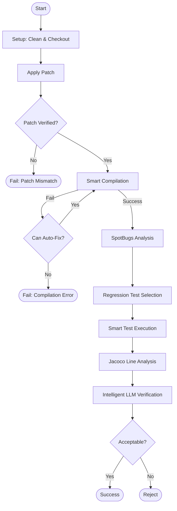

# Validation Agent Architecture

This document details the architecture of the `Validation Agent`, the "Gatekeeper" component responsible for verifying generated backports.

## High-Level Workflow

The agent follows a pipeline approach: **Setup -> Apply -> Verify -> Compile -> Test -> Analyze**.

## Core Mechanisms (Deep Dive)

### 1. Regression Test Selection (RTS)
**Goal**: Find existing tests that might break because of our changes, without running the entire test suite (which takes too long).

**Logic**:
1.  **Identify Targets**: Extract the class names from the modified files in the patch (e.g., `src/.../RestAdapter.java` -> `RestAdapter`).
2.  **Scan Repo**: Recursively walk the repository looking for `*Test.java` files.
3.  **Content Search**: For each test file, read the content and check if it references any of the target classes.
    *   *Heuristic*: Uses a regex boundary search `\bClassName\b` to avoid partial matches.
    *   *Example*: If `RestAdapter` changed, and `RestAdapterTest.java` contains `new RestAdapter()`, it is selected.
4.  **Result**: A list of "Candidate Tests" is generated and added to the validation queue.

### 2. Smart Compilation
**Goal**: Compile a partial set of files in a complex, multi-module project without a full build system.

**Logic**:
1.  **Source Root Inference**: For each file, the agent reads the `package` declaration (e.g., `package com.example;`) and cross-references it with the file path (`.../src/main/java/com/example/Foo.java`) to deduce the Source Root (`.../src/main/java`).
2.  **Module Detection**: Checks file paths for OpenJDK module patterns (`src/java.base/...`) or `module-info.java` to identify JPMS modules.
3.  **Conflict Resolution Loop**:
    *   Runs `javac`.
    *   If `javac` fails with `error: package exists in another module: java.desktop`:
    *   The agent captures this error, identifies the conflicting module (`java.desktop`), and **automatically patches** the compile command.
    *   **New Command**: adds `--patch-module java.desktop=/path/to/our/source`.
    *   Retries compilation.

### 3. Patch-Specific Coverage
**Goal**: Ensure we actually tested the *lines we changed*, not just that we ran a test that touched the file.

**Logic**:
1.  **Line Extraction**: parses the `.patch` file using `unidiff` to get a map of Changed Lines.
    *   *Map*: `{"RestAdapter.java": [50, 51, 52]}`.
2.  **Instrumentation**: Runs the test with `-javaagent:jacocoagent.jar`.
3.  **XML Generation**: Converts the binary coverage dump to an XML report.
4.  **Intersection Analysis**:
    *   Parses the XML to find the coverage status of lines 50, 51, and 52.
    *   If line 50 is Green (Covered) and 51 is Red (Missed), **Patch Coverage** is 33%.
5.  **Relevance**: This metric is prioritized over general File Coverage (which might be 1% for a huge file) in the LLM's final decision.

### 4. Intelligent Analysis (LLM)
**Goal**: Make a human-like decision on whether the backport is acceptable, considering all signals.

**Logic**:
*   **Context**: The LLM ("Senior Java Reviewer") is fed:
    *   The Implementation Plan.
    *   The raw Patch.
    *   SpotBugs warnings.
    *   Test Results (Pass/Fail) + **Patch Coverage %**.
*   **Decision**: It evaluates consistency.
    *   *Example*: "The patch compiles and passes tests, but Patch Coverage is 0%, meaning the logic wasn't actually exercised. REJECT."
    *   *Example*: "SpotBugs found a null pointer risk in the new code. REJECT."

## Component Tools

| Tool | Purpose | Implementation |
| :--- | :--- | :--- |
| **`ValidationToolkit`** | Stateless executor | `javac`, `java`, `git` subprocess calls |
| **`PatchAnalyzer`** | Diff parsing | `unidiff` library |
| **Jacoco** | Code Coverage | Agent (`-javaagent`) + CLI (`nodeps`) |
| **LangChain** | Decision Making | Gemini 2.5 Flash (`temperature=0`) |
